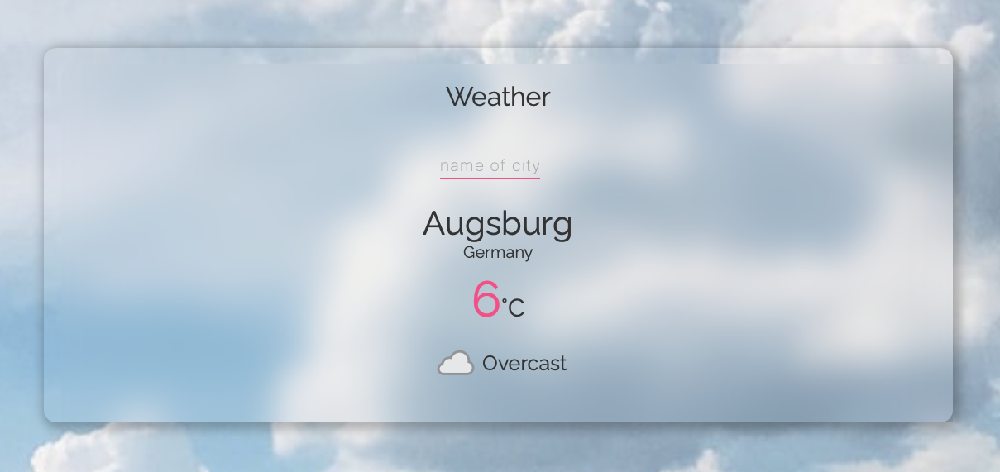

# TypeScript WeatherApp

## Task

We will create a weather app following the textbook "The First React
App with TypeScript" (Japanese). The weather app

- accepts a name of a city
- hits the API at the website (weatherapi)[https://www.weatherapi.com]
- returns
   + temperature
   + weather (sunny/cloudy/rainy etc.)
   + icon

We will see how React functions in a TypeScript code.


This repository is cloned from the [textbook repo](https://github.com/mod728/react-typescript-book-weather-app).

The tech stack we will learn on the way are

1. Node.js (and npm within)
2. TypeScript
3. React
4. Netlify (to deploy)


## Quick Summary

1. Download (`node.js`)[https://nodejs.org/en/download/].
   - choose 'LTS'
   - `npm` comes together with `node.js`

2. Get React template files.
   `npx create-react-app react-typescript-weather-app --template typescript`

    This means to create a copy of `create-react-app` to my local
    machine with the name `react-typescript-weather-app`, and use
    typescript template at when making a copy.

3. `cd react-typescript-weather-app`

```
.
├── README.md
├── node_modules
├── package-lock.json
├── package.json
├── public
├── src
└── tsconfig.json
```

    We will clone the textbook repo to `src` directory, and work there. .  


4. `npm start`

    This give us an App development platform. As we edit the source codes
    we can see the output at `http://localhost:3000`.

    `Ctrl + C` to stop the server. 
    

5.  Edit the source codes.

./src
├── App.css
├── App.scss
├── App.tsx
├── components
│   ├── Form.tsx
│   ├── Loading.tsx
│   ├── Results.tsx
│   └── Title.tsx
├── index.tsx
├── react-app-env.d.ts
└── reportWebVitals.ts


6.  Sign up (netlify)[http://www.netlify.com].
    - One can sign up with GitHub ID.
    - We will give netlify an access to GitHub.
    - We do not need to build the app ourselves. netlify does that.
    - When a build is successful netlify returns an URL of the app.

   


## To-DO
1. Full annotation in source codes.
2. Brush up.
3. Gatsby/Next.js

